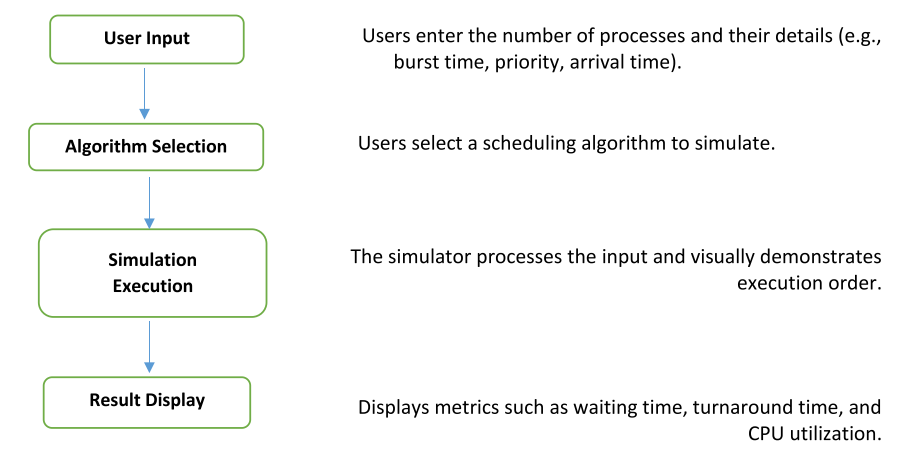

# Project Title: CPU Scheduling Simulator

## Objective: 
The objective of this project is to develop a Java-based simulator that enables users to visualize and analyse various CPU scheduling algorithms.

## Introduction:
CPU scheduling, in operating systems, determining the order of process execution by the CPU. This simulator provides an interactive platform where users can evaluate several scheduling algorithms, including First-Come, First-Served (FCFS), Shortest Job Next (SJN), Round Robin (RR) and more.

## Problem Statement
Choosing the right CPU scheduling algorithm is essential for optimizing performance in operating systems. Different algorithms have unique characteristics, and selecting the most appropriate one depends on various performance criteria, such as maximizing response time or minimizing average waiting time. The challenge is to determine the best algorithm for a specific scenario. This project addresses this challenge by allowing users to experiment with and compare the performance of different algorithms in a simulated environment.

## DFD/Use Case Diagram

## Technology to Be Used
 - **Programming Language:** Java 
 - **User Interface:** Graphical User Interface (GUI) using Java Swing 
 - **Development Environment:** Java Development Kit (JDK) 8 or higher, and Java IDE.

## Features: 
 - Simulates multiple CPU scheduling algorithms (FCFS, SJN, RR, PQ) 
 - User-friendly GUI for input and visualization 
 - Detailed output showing execution order and performance metrics 
 - Custom data structures for managing processes

## Usage: 
To run the simulator, compile the project, execute the main class, select the desired algorithm, input process data, and view the results.